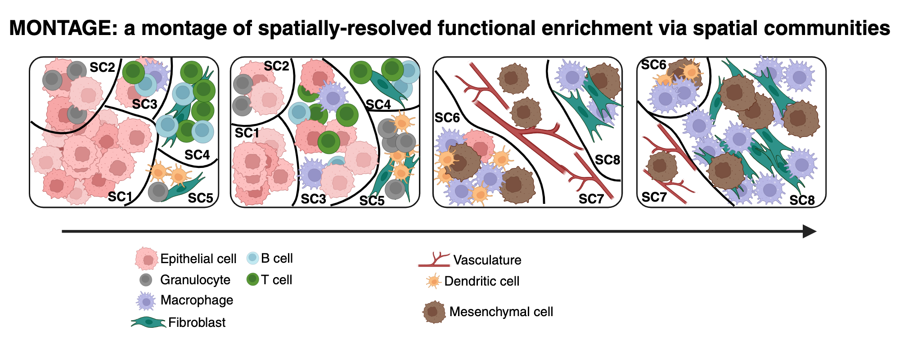

<!-- README.md is generated from README.Rmd. Please edit that file -->

# MONTAGE

 <!-- badges: start -->
<!-- badges: end -->

MONTAGE (spatial coMmunities along functiOnal eNrichment by single-cell
spaTiAl proteomics and sequencinG intEgration) is a computational
framework to reconstruct, functionally quantify and determine
clinically-relevant spatial communities (SCs).

MONTAGE creates a spatial community gene signature matrix that expresses
spatial communities in terms of their gene transcriptomic signatures by
integrating single-cell spatial proteomic/transcriptomic and single-cell
RNA sequencing data. MONTAGE derives a sequence of spatial community
compositions (aka “montages”) along spatial gradients of functional gene
enrichment of biological processes within tissue. Using its underlying
signature matrix, MONTAGE can be applied to deconvolve large, publicly
available transcriptomic datasets that lack single-cell resolution into
spatial community compositions; this deconvolution serves as an
augmenting alternative to common deconvolution by cell type
compositions.

In this vignette, there are three main components described below to
demonstrate the three main steps in the MONTAGE framework: (1) spatial
community identification (2) signature matrix generation (3) creating
montages along spatially-resolved gradient of a certian biological
function enrichment.

## Installation

You can install the development version of MONTAGE

``` r
# install.packages("devtools")
devtools::install_github("plevritis-lab/MONTAGE")
library(MONTAGE)
```

## Dependency

MONTAGE requires dependency on the following R packages:

- [GSVA](https://www.bioconductor.org/packages/release/bioc/html/GSVA.html):
  for performing gene set functional enrichment

- [spdep](https://cran.r-project.org/web/packages/spdep/index.html): for
  obtaining spatial neighborhood information

- [ggplot2](https://cran.r-project.org/web/packages/ggplot2/index.html):
  for plotting functions

- [gplots](https://cran.r-project.org/web/packages/gplots/index.html):
  for plotting functions

- [ggforce](https://ggforce.data-imaginist.com/): for plotting Voronoi
  diamgrams

- [RColorBrewer](https://cran.r-project.org/web/packages/RColorBrewer/index.html):
  for color generation of plotting cells in the tissue

## Usage: Part I (spatial community identification)

This part provides an implementation for spatial community
identification using single-cell resolution spatial omic data, such as
spatial proteomics data. The main input to this part is a metadata file
with each row corresponding to a cell, and columns containing
information for X and Y coordinates of the cells in situ, sample IDs and
cell type annotations. Please refer to an example of pre-saved metadata.
*Please note that the column names need to follow the example metadata.*

``` r
### Metadata of the spatial omics data
data("metadata")
```

Please provide a list of sample IDs. Here, an example sample ID list
from a study cohort of head and neck cancer (HNSCC) dataset
(<https://www.synapse.org/Synapse:syn26242593/wiki/613000>) is used.

``` r
### A list of samples included in the data
sample_id <- c("scc7268","scc7275","scc7233","scc7238","scc7240","scc7267",
               "scc7233B", "scc7240B", "scc7267B", "scc7276B")
```

The following function identifies the N-nearest neighboring cells, and
calculate the cell type densities within the N-nearest neighbors

``` r
### Cell neighborhood density matrix (for each cell neighborhood, calculate the cell type densities)
### 10-nearest neighbors is used. The "cell_types" requires a vector of cell types 
### identified in the spatial omic data.
cell_neighborhood_density_matrix <- Neighborhood_Density(metadata,number_of_neighbors=10, cell_types=unique(metadata$cell_type),sample_id)
```

This function performs clustering on a matirx with each row is a cell
and each column is the cell type densities in the N-nearest neighborhood
to identify spatial neighborhood. For reference, over-clustering is
illustrated and then the clusters are merged manually based on assessing
the spatial omic images.

``` r
### For reproducibility of the clustering, use pre-saved cluster centers
data("cluster_center")
### Run clustering on the cell neighborhood density matrix
### Overcluster to 30
initial_neighborhood_clustering <- Spatial_Neighborhood_Clustering(n_neighborhood=30,neighbor_matrix=cell_neighborhood_density_matrix,metadata,cell_types=unique(metadata$cell_type),cluster_center)
```

This function performs clustering on the spatial neighborhood cell type
compositions to identify the spatial communities.

``` r
### Manually assign a name to each spatial neighborhood based on cell type compositions, 
### and merge clusters with the same names from the previous round of clustering.
### A pre-saved example of the spatial neighborhood matrix is illustrated below.
data("spatial_neighborhood_anno")
### Run clustering on the spatial neighborhood cell type compositions
### for spatial communities. We recommend 8-10 spatial community clusters based on testing
### adjacent spatial omic and bulk RNA-seq slices.
spatial_community_clustering <- Spatial_Community_Clustering(initial_neighborhood_clustering,neighborhood_cell_composition=spatial_neighborhood_anno,
                                                             metadata,n_community=8)
```

This function produces the final output metadata with spatial
neighborhood and spatial community annotations for each cell, appending
to the initial metadata

``` r
### Spatial communities are annotated by assessing the cell type compositions 
### in each spatial community, and manually assigned a name
### A pre-saved example of the spatial community matrix is illustrated below
data("spatial_community_anno")
final_metadata <- Annotate_Cell_Community(cell_spatial_community_cluster=spatial_community_clustering,
                                          spatial_community_anno,metadata)
```

The following functions provide examples to plot the cell types, cell
spatial neighborhoods,and cell spatial communities back onto the
original spatial omic images.

``` r
### Plot cell types onto the original spatial omic images. "scc7267" is an example sample.
### This example only plots user defined cell types and uses default colors
Plot_Cells(metadata=final_metadata,sample_to_check="scc7267",
           cell_types_to_plot=c("Macrophages","Fibroblasts","Malignant cells","Endothelial cells",
                                 "Cytotoxic T cells","Granulocytes")) 

### This example plots all the cell types and uses user-supplied colors
Plot_Cells(metadata=final_metadata,sample_to_check="scc7267",
           cell_types_to_plot=unique(metadata$cell_type),
           cell_type_colors = c("magenta","cyan","orange2","blue","yellow1","springgreen","hotpink","yellowgreen","red","mediumpurple1","white","green4","plum1","khaki3"),                   
           test_size = 0.2) 

### Plot all the spatial neighborhoods onto the original spatial omic images
### using default colors
Plot_Neighborhood(metadata=final_metadata,sample_to_check="scc7267",
                  neighborhood_to_plot=unique(final_metadata$spatial_neighborhood),
                  test_size=0.2)

### Plot all the spatial communities onto the original spatial omic images
### using user-supplied colors
Plot_Community(metadata=final_metadata,sample_to_check="scc7267",
               community_to_plot=unique(final_metadata$spatial_community),
               community_colors = c("green3","coral","lightblue","purple","gold","pink2","firebrick","blue"),
               test_size=0.2)
```

Example output of sample cell type plot: 

Example output of sample cell spatial community plot: 

## Usage: Part II (signature matrix generation)

The second part provide an example to generate the MONTAGE signature
matrix. *Please note that this part can be independent of Part I with
any user-defined spatial communities*.

The second part requires two inputs: Matrix G and Matrix S from
single-cell RNA sequencing and single-cell spatial omics data. Pre-saved
examples are illustrated below.

Matrix G: each row is a gene and each column is a cell type. This matrix
has the cell type marker genes for the corresponding cell types, which
can be obtained by performing differentially expressed genes using
single-cell RNA sequencing data. Matrix G is p-by-k, where p is the
number of genes, and k is the number of cell types.

Matrix S: each row is a cell type and each column is a spatial
community. This matrix contains the cell type compositions for each
spatial community, which can be obtained from Part I above.Matrix S is
k-by-n, where k is the number of cell types and n is the number of
spatial communities.

Please note that potentially single-cell resolution spatial
transcriptomic data with enough transcriptomic coverage could also be
used to create the two input matrices.

*The two matrices need to have the same number of cell types.*

This step creates and saves the MONTAGE signature matrix that can be
applied in deconvolution methods, such as CIBERSORT, to deconvolve bulk
RNA-seq or spot-based spatial transcriptomic (e.g. Visium) into spatial
community compositions.

``` r
### Inputs:
### (1) Matrix G: each row is a gene, and each column is a cell type
### (2) Matrix S: each row is a cell type, and each column is a community
data("Matrix_G_file")
data("Matrix_S_file")

### Call the createSignatureMatrix function
MONTAGE_signature_matrix <- Create_Signature_Matrix(Matrix_G=Matrix_G_file,
                                                    Matrix_S=Matrix_S_file)
```

## Usage: Part III (creating montages along spatially-resolved gradient of a certian biological function enrichment)

This part performs functional enrichment of the spatial community gene
signatures in the MONTAGE signature matrix. MsigDB Hallmark genesets are
used as an example. But any biological function gene signature set can
be used. Included in the MsigDB Hallmark genesets, we demonstrate the
montage creation using the Epithelial-Mesenchymal Transition gene
signature set.

``` r
data("gene_sets") # Pre-saved MsigDB Hallmark genesets
data("SC_signature") # Example MONTAGE signature matrix for HNSCC generated in Part II

### Perform functional enrichment using GSVA for each spatial community for each geneset
enrichment <- Enrichment_Calculation(gene_sets,SC_signature)
```

This function superimposes the enrichment scores onto the original
spatial omic image.

``` r
### Voronoi plot runs slow, and it take about 1min for 50k cells on a typical Macbook
### scc7267 is an example sample in the HNSCC study cohort
Plot_Enrichment_Voronoi(metadata=final_metadata,
                        sample_to_check="scc7267",
                        enrichment_scores=enrichment,
                        gene_set_name="EPITHELIAL MESENCHYMAL TRANSITION",
                        test_size=0.1)
```

Example output of sample spatial functional enrichment plot
(Epithelial-Mesenchymal transition enrichment scores): 

Identify the regions along a spatial gradient of a certain biological
functional enrichment

``` r
### This function saves the identified regions for each sample into a local folder
### named ("Montage_gene_set_name")
### This function takes a few minutes to process all the whole-slide tissue samples
### EPITHELIAL MESENCHYMAL TRANSITION is used as an exmaple
Identify_Gradient(metadata=final_metadata,gene_set_name="EPITHELIAL MESENCHYMAL TRANSITION",
                  enrichment_scores=enrichment,samples=unique(metadata$sample))
### Plot the identified regions along spatial gradient for each cell in the image
### This function is slow, which take about 1min for a tissue of 50k cells
Plot_Regions(metadata=final_metadata,sample_to_plot="scc7267",
             gene_set_name="EPITHELIAL MESENCHYMAL TRANSITION")
```

Example output of sample region plot along gradient of increasing
functional enrichment (Epithelial-Mesenchymal transition enrichment
scores): 

Create a heatmap for the montage displaying the spatial community
compositions along the spatial gradient

``` r
Create_Montage_Heatmap(metadata=final_metadata,
                       gene_set_name="EPITHELIAL MESENCHYMAL TRANSITION")
### Plot cell spatial communities for a certain region along the spatial gradient
gene_set_name <- "EPITHELIAL MESENCHYMAL TRANSITION"
Plot_Community_in_Region(metadata=final_metadata,
                         sample_to_check="scc7267",
                         community_to_check=unique(final_metadata$spatial_community),
                         region_to_plot=paste0("transitional-low ",gene_set_name), #transitional-low region
                         community_colors=c("green3","coral","lightblue","purple",
                                            "gold","pink2","firebrick","blue"),
                         test_size=0.1)
```

## Getting help

If you encounter a clear bug, please file an issue with a minimal
reproducible example on
[GitHub](https://github.com/plevritis/MONTAGE/issues).
